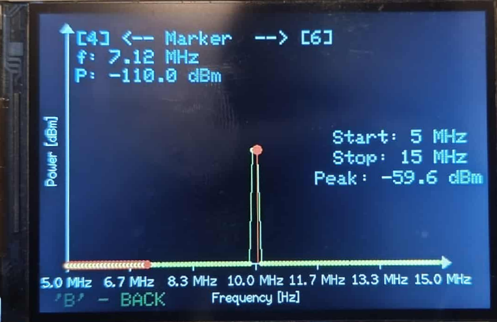

\# Selektywny miernik mocy na fale krótkie

\## Opis projektu

Projekt obejmuje zaprojektowanie i realizację selektywnego miernika mocy na zakres fal krótkich wraz wykonaniem oprogramowania sterującego.  

Urządzenie oparte jest na klasycznym torze superheterodynowym z dwoma przemianami częstotliwości, umożliwijącymi uzyskanie wysokiej selektywności.  

Projektowany selektywny miernik mocy został podzielony na dwie zasadnicze części funkcjonalne: część radiową oraz część sterującą, które przedstawiono na schemacie
blokowym ponieżej.
Część radiowa odpowiada za przyjęcie sygnału wejściowego, jego wstępną filtrację, przemiany częstotliwościowe oraz detekcję mocy. Sygnał wejściowy trafia  najpierw do filtru wejściowego FW, który ogranicza pasmo sygnału i tłumi niepożądane składowe spoza zakresu pracy. Następnie przechodzi do bloku przełączanego wzmacniacza, gdzie– w zależności od ustawienia przekaźnika– tor sygnałowy może być wzmocniony przez wzmacniacz AMP lub przekazany dalej bez dodatkowego wzmocnienia. 
Kolejnym etapem jest pierwsza przemiana częstotliwości. Sygnał z toru wejściowego jest mieszany w układzie M1 z sygnałem lokalnego generatora LO, co daje częstotliwość pośrednią IF1 równą 45 MHz.
Po mieszaczu sygnał jest filtrowany przez filtr kwarcowy, który zawęża pasmo do wybranego zakresu.
W dalszej części toru realizowana jest druga przemiana częstotliwości w mieszaczu M2 z doprowadzonym sygnałem oscylatora kwarcowego o częstotliwości 45,545 MHz.
Wynikiem mieszania jest druga częstotliwość pośrednia IF2 o wartości 455 kHz. Na tym etapie stosowany jest filtr ceramiczny, który jeszcze bardziej zawęża pasmo i zapewnia selektywność odbioru. 
Po przemianach częstotliwości sygnał jest wzmacniany w kaskadzie wzmacniaczy oznaczonych jako blok wzmocnienia. Kolejnym elementem jest przełączany tłumik T1, który umożliwia wprowadzenie dodatkowego tłumienia lub jego obejście, w zależności
od ustawień układu sterowania przekaźnikami.

Ostatni etap toru radiowego stanowi blok wzmocnienia i detekcji logarytmicznej.
Sygnał jest tam wzmacniany przez wzmacniacz LNA2, a następnie tra a do wzmacniacza logarytmicznego LOG, którego wyjściowe napięcie stałoprądowe stanowi bezpośrednią miarę mocy badanego sygnału.
Część sterująca została zrealizowana w oparciu o mikrokontroler, który pełni rolę nadrzędną w całym układzie. 
Odpowiada on za przestrajanie częstotliwości generatora lokalnego. 
Ponadto steruje przekaźnikami przełączającymi tor pomiarowy (wzmacniacz, tłumik), a także odbiera sygnał analogowy z wzmacniacza logarytmicznego poprzez prze
twornik ADC. Następnie dokonuje przeliczenia wartości napięcia na jednostki pomiarowe i prezentuje wynik na wyświetlaczu TFT. 
Mikrokontroler współpracuje z klawiaturą, enkoderem i przyciskami, które umożliwiają intuicyjną zmianę częstotliwości pracy oraz konfigurację pomiaru.
Takie rozdzielenie funkcji pozwala na uzyskanie czytelnej struktury systemu: część radiowa odpowiada za selektywną obróbkę sygnału, a część sterująca realizuje zadania związane z kontrolą i prezentacją wyników pomiaru.

\## Schematy blokowe

-Schemat blokowy układu 

-Schemat blokowy oprogramowania 

---

\## PCB

\-PCB_layout 
\-Oscylator kwarcowy 

\-PCB widok od dołu 

\-PCB widok od góry 

---

\## Fotografie układu

\- Interfejs użytkownika- Po włączeniu urządzenia na ekranie wyświetla się główny panel sterowania, na którym widoczny jest napis „SET FREQUENCY [Hz]”. 
Na tym panelu prezentowany jest również aktualny stan tłumika (Attenuator) oraz wzmacniacza (Amplifier) — oba elementy są domyślnie wyłączone.
Sterowanie stanem tłumika i wzmacniacza odbywa się za pomocą klawiszy funkcyjnych, które na ekranie są oznaczone kolorami odpowiadającymi przyciskom fizycznym:
biały przycisk służy do włączania/wyłączania tłumika, a niebieski — wzmacniacza, co jest wyraźnie zaznaczone na wyświetlaczu.
Urządzenie umożliwia pomiar sygnałów w zakresie częstotliwości od 1,8 MHz do 30 MHz, co obejmuje m.in. pasma krótkofalarskie oraz inne zastosowania w tym przedziale. 
Zakres możliwych do zmierzenia mocy zależy od konfiguracji układu i wynosi:

* Konfiguracja bazowa: P_in= −100 dBm do −34 dBm

* Z załączonym wzmacniaczem: P_in = −110 dBm do −40 dBm,
* Z załączonym tłumikiem: P_in = −94 dBm do −25 dBm.

Dodatkowo na ekranie dostępne są skróty do trybów specjalnych — pod klawiszem
„#” znajduje się „HELP”, czyli instrukcja obsługi, natomiast pod klawiszem „∗” — tryb „EMC”  do pomiaru emisji zaburzeń elektromagnetycznych (EMI). 
W trybie „EMC” przy pomocy klawiszy 4 i 6 możliwe jest przesuwanie markera, który widoczny jest w postaci czerwonych punktów na ekranie. 
Oba tryby można wywołać bezpośrednio z poziomu głównego panelu.

\- Tryb skanu EMC 

\- Tryb zawierający POMOC 

\-Pomiar mocy dla sygnału -30dBm 

\-Pomiar mocy dla sygnału -90dBm

---

\## Screenshots

\-Alternatywne sterowanie z PC. 
Po połączneniu przez Serial automatycznie wyświetlana jest funkcja pomocy, zawieraąca instrukcję obłsugi sterowania przy pomocy komptera PC. Po zastosowaniu danej komendy użytkownik otrzymuje infeformację zwrotną z systemu.

---

Miernik umożliwia pomiary w szerokim zakresie mocy wejściowych, sięgającym około 85 dB. Najniższy poziom mocy sygnału, jaki można wiarygodnie zmierzyć, wynosi −110 dBm(przy włączonym wzmacniaczu), natomiast najwyższy sięga −25 dBm (z tłumikiem).
Błąd liniowości w całym zakresie pracy nie przekracza ±0,7 dB.
Wykorzystanie mikrokontrolera ESP32 pozwoliło na elastyczne zarządzanie całym systemem oraz integrację funkcji sterujących i pomiarowych. 
Realizacja pracy potwierdziła możliwość budowy kompaktowego i funkcjonalnego miernika mocy na fale krótkie, który może znaleźć zastosowanie w zastosowaniach amatorskich i edukacyjnych

\## Link do CV

\- \[Marcin Baziak – CV](https://www.linkedin.com/in/marcin-baziak/)

