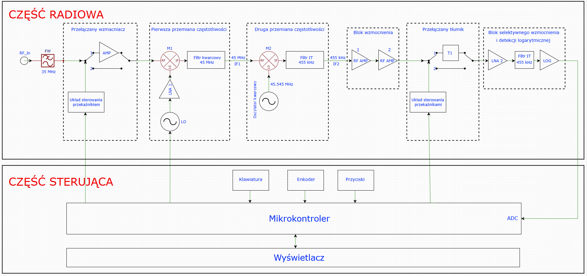
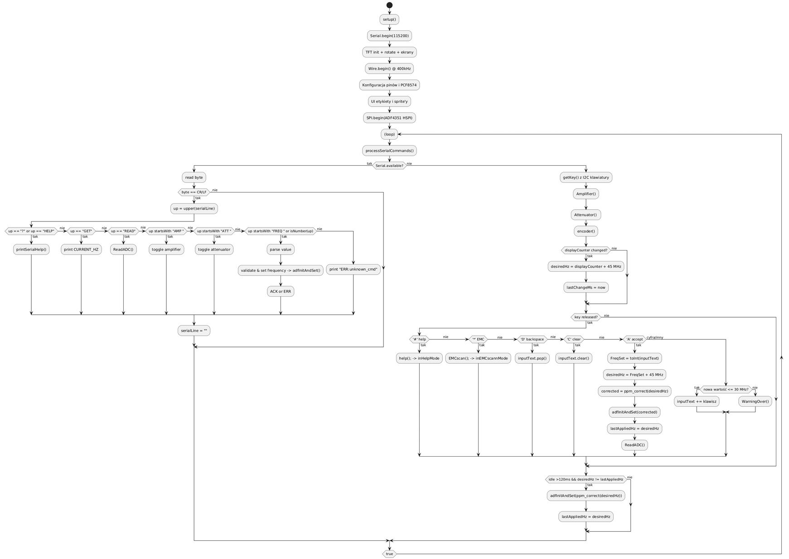
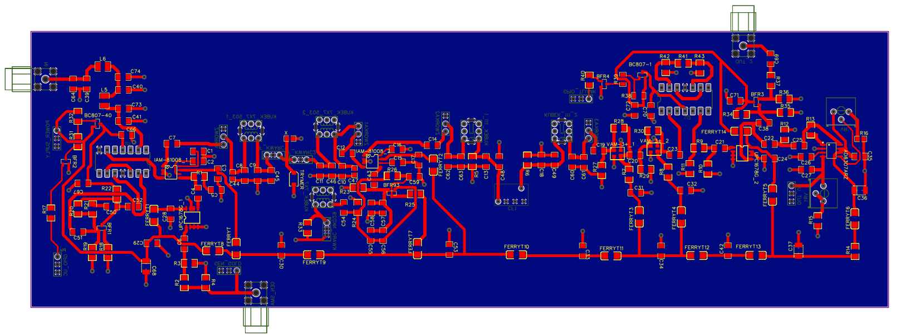
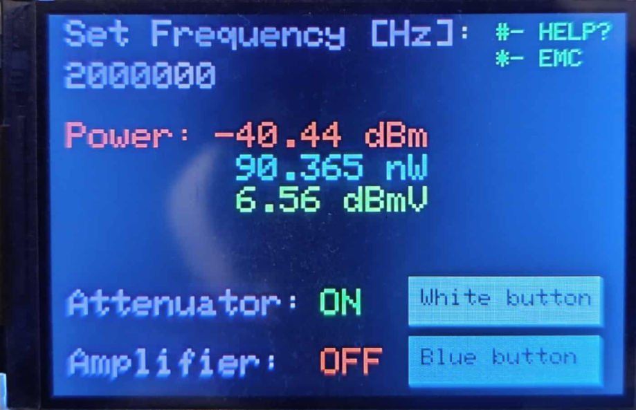
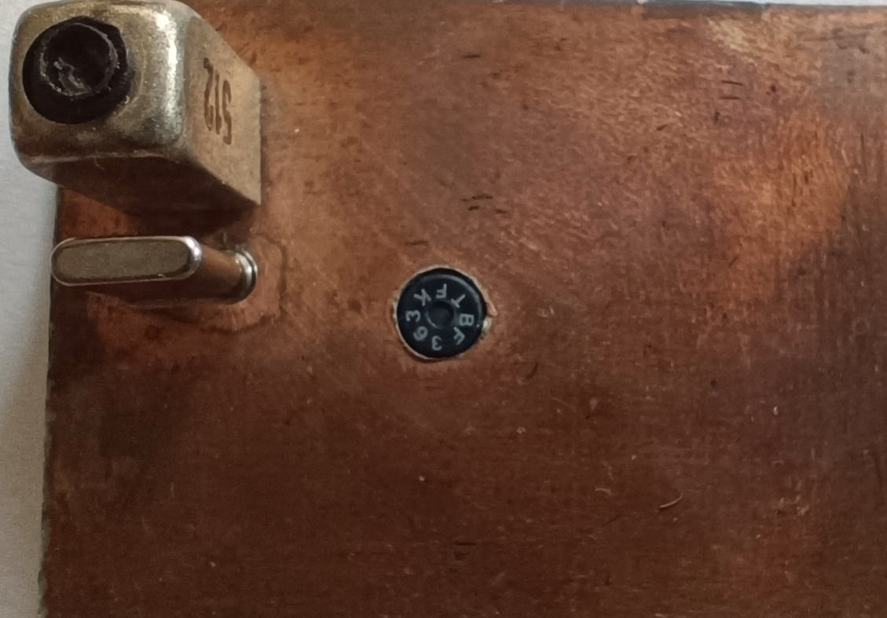
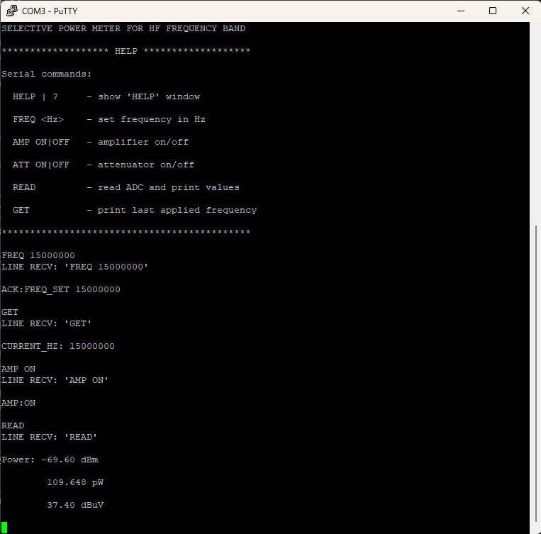

\# Selektywny miernik mocy na fale krótkie

\## Opis projektu

Projekt obejmuje zaprojektowanie i realizację selektywnego miernika mocy na zakres fal krótkich wraz wykonaniem oprogramowania sterującego.  

Urządzenie oparte jest na klasycznym torze superheterodynowym z dwoma przemianami częstotliwości, co pozwala uzyskać wysoką selektywność.  

Projekt składa się z dwóch głównych części:  

1\. \*\*Część radiowa:\*\* filtr wejściowy, przełączany wzmacniacz, dwie przemiany częstotliwości (mieszacze + filtry pasmowe), blok wzmacniacza i detektor logarytmiczny do pomiaru mocy.  

2\. \*\*Część sterująca:\*\* mikrokontroler ESP32, sterowanie generatorami LO, przekaźnikami, odczyt ADC, wyświetlacz TFT, klawiatura i enkoder.  

Projekt uwzględnia prototypowanie PCB, testy filtrów, mieszaczy i oscylatorów oraz pomiary charakterystyk toru RF.

---

\## Schematy blokowe

-Schemat blokowy 

-Schemat blokowy oprogramowania 

---

\## PCB

\-PCB_layout 

\-PCB widok od góry 

\-PCB widok od dołu 

---

\## Fotografie układu

\- 
\- 

\- 

\- 

---

\## Screenshots

\- 

---

\## Technologie i narzędzia

\- \*\*Technika Radiowa:\*\* heterodynowa przemiana częstotliwości, filtry pasmowe, detekcja logarytmiczna, dopasowanie impedancyjne, selektywność, czułość, dynamika  

\- \*\*Mikrokontrolery i programowanie:\*\* ESP32, C/C++  

\- \*\*Prototypowanie i montaż:\*\* PCB, lutowanie SMD/THT  

\- \*\*Pomiar i aparatura:\*\* VNA, analizator widma, generatory sygnałowe  

\- \*\*CAD RF:\*\* AWR Cadence, projektowanie filtrów, analiza charakterystyk częstotliwościowych, EasyEda  

---

\## Link do CV

\- \[Marcin Baziak – CV](https://www.linkedin.com/in/marcin-baziak/)

